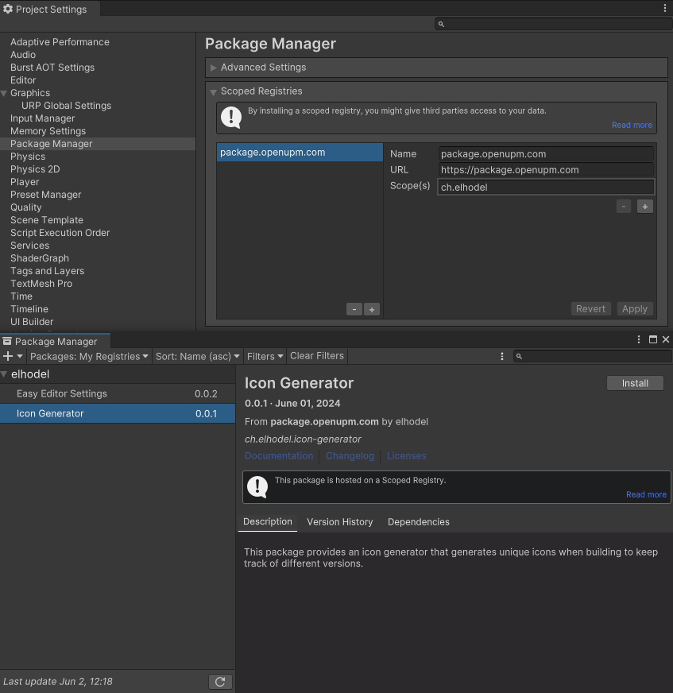

# Icon Generator

Simple Icon Generator for Unity that generates new Icons for your App based on Product name, Timestamp and Version every time you build to easily distinguish which Version you have currently installed.

## Features

- Generate icon and include product name, timestamp and version every time you build
- Change Icon color based on version number or get a random color
- Set a manual background
- Set resolution
- Disable automatic generation 

## Examples


## Installation

The Package is hosted on UPM (https://openupm.com/packages/ch.elhodel.icon-generator/) there are different ways to install the package:

- Add a scoped registry in the Project Settings and then select the package in the package manager: 
  

  **Name**: `package.openupm.com`
  
  **URL**: `https://package.openupm.com`

  **Scope**: `ch.elhodel

- Use the UPM CLI: `openupm add ch.elhodel.icon-generator`
  For more details check UPMs Guide: https://openupm.com/docs/getting-started-cli.html

- Manually add it to the manifest.json:
  Merge this snippet in your projects manifest.json:

  ``````json
  {
      "scopedRegistries": [
          {
              "name": "package.openupm.com",
              "url": "https://package.openupm.com",
              "scopes": [
                  "ch.elhodel"
              ]
          }
      ],
      "dependencies": {
          "ch.elhodel.icon-generator": "0.0.1"
      }
  }
  ``````


## Dependencies

Uses my other Project [Easy Editor Settings](https://github.com/elhodel/EasyEditorSettings) for the Settings

Uses TextMesh Pro for Text
